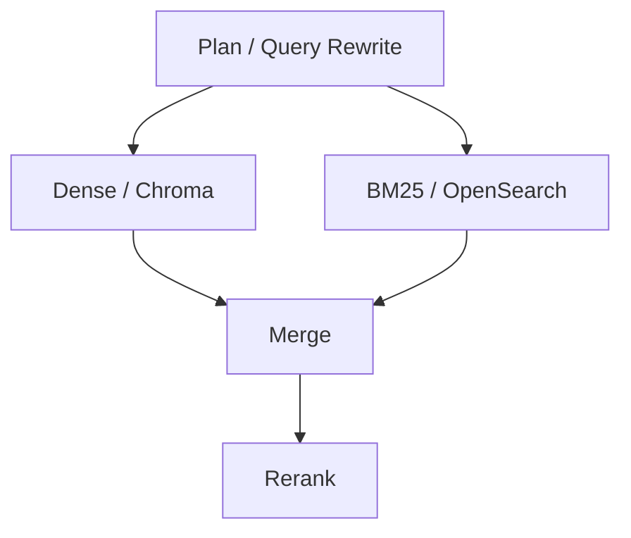

# RAG 子图四节点评估与 Rerank Rubric 优化报告

> **目的**
>
> - **全链路评估**：量化 RAG 子图四个节点（Query Rewrite / Dense / BM25 / Rerank）各自表现，定位瓶颈。
> - **优化 Rerank**：Rerank 是最大瓶颈，尝试聚类去重 + 扩 TopK 提升事件保留率。
> - **探索自动 Rubric**：按 AutoMetrics 思路，验证能否将手工 rubric 替换为 Agent 自动生成和筛选的版本。
>
> **核心结论**
>
> - **[全链路评估](#1-总体诊断)**：Query Rewrite **89.8/100**，Dense Event Recall **80.7%**，BM25 Event Recall **74.3%**，Rerank Rubric Score **66.2/100**。核心瓶颈是”召回到了但没进 TopK”。
> - **[优化 Rerank](#3-rerank-前去重聚类优化)**：聚类去重 + TopK 扩大后，事件保留率 **65.8% → 70.6%**，Reference Event Recall **52.6% → 58.3%**。
> - **[探索自动 Rubric](#4-rerank-rubric-自动优化试验)**：流程已跑通。但当前仍是可行性验证版本。

## 1. 总体诊断

评估对象只包含 RAG 子图，不包含 Supervisor、Compress 和 Final Report。链路为：



四个节点的基线表现如下：

| 节点 | 主指标 | 判断 |
|---|---:|---|
| 意图拆解 / Query Rewrite | Rubic Score 89.8/100 | 子查询覆盖完整，约束正确，不是当前瓶颈 |
| Dense / Chroma | Macro Event Recall 80.7% | 向量召回是主要召回来源 |
| BM25 / OpenSearch | Macro Event Recall 74.3% | 词法召回有效，但弱于 Dense |
| Rerank | Rubric Score 66.2/100 | 当前最大瓶颈，会丢掉已召回事件 |

一句话总结：**系统已经能把大部分相关事件召回来，但 Rerank 没有稳定保住这些事件。**，这说明问题不是“完全没找到”，而是“找到了但没进最终 TopK”。

全局诊断也支持这个判断：

| 阶段 | 全局 Event Recall | 说明 |
|---|---:|---|
| Dense union | 85.0% | 召回层整体覆盖已经不差 |
| BM25 union | 85.0% | BM25 能补充召回，但强度低于 Dense |
| Rerank union | 70.0% | Rerank 后进一步丢失事件 |


## 2. 评估指标介绍

### 2.1 意图拆解 / Query Rewrite

Query Rewrite 没有稳定硬真值，所以采用 rubric 自动评分。它主要看四件事：

| 维度 | 权重 | 含义 |
|---|---:|---|
| Coverage | 35% | 是否覆盖海外头部、国内厂商、开源、多模态、视频/语音、代码/Agent/推理等方向 |
| Constraint Accuracy | 20% | 日期、分类、发布任务约束是否正确 |
| Diversity | 20% | 子查询之间是否重复 |
| Rerank Feedback | 25% | 子查询执行后的 rerank 分数、高分文档率、新增高分文档率 |


判断：Plan 节点表现稳定，能把任务拆成较完整的查询集合。当前不应该优先继续调 Query Rewrite。

### 2.2 Dense / Chroma

Dense 节点使用向量召回。每个 execute 返回固定规模的候选池，评估时先把候选映射回事件，再计算该 query 的事件召回。

核心公式：

```text
event_recall_i =
  |pred_events_i ∩ GT_events_i| / |GT_events_i|
```

最终按 execute 做宏平均。

判断：Dense 是当前最强的召回来源。Precision 偏低可以接受，因为这一阶段目标是扩大候选池，而不是直接产出最终答案。

### 2.3 BM25 / OpenSearch

BM25 节点使用 OpenSearch 做词法召回。评估口径与 Dense 一样，也是按 execute 计算，再做宏平均。

本次结果：

- Macro Event Recall：74.3%
- Article Precision / Recall / F1：12.6% / 44.3% / 15.9%
- Union Event Recall：85.0%

判断：BM25 有补充价值，尤其适合命中模型名、厂商名、版本号等明确词面。但整体质量弱于 Dense，更适合作为补充召回，而不是主召回。

### 2.4 Rerank

Rerank 的职责不是再扩大召回，而是从 Merge 后的大候选池里选出最值得进入压缩阶段的 TopK。本轮 rubric 的设计参考**日报系统**，根据对部门同事的采访整理而来：它既要选出真正有业务影响的事件，也要避免被同一来源或同一热点反复刷屏。

评分分成四个维度：

| 维度 | 计算方式 | 含义 |
|---|---|---|
| impact | LLM 语义判断 | 事件的实际影响力 |
| controversy | LLM 语义判断 | 事件是否有争议、讨论度或行业分歧 |
| prominence | 程序规则 | 事件主体是否是头部公司，基于 tier1、tier2 白名单映射 |
| heat | 程序规则 | 同一事件的重复报道强度 |

最后再加一个来源灌水惩罚，防止高产媒体刷榜。当前 AI 类别的公式是：

```text
CommonScore = 0.65*impact + 0.50*prominence + 0.20*heat + 0.10*controversy
FinalScore = CommonScore - 0.75*penalty_score
```

这样设计的原因是：

- 语义理解交给 LLM 更合适，例如 impact 和 controversy 很难只靠关键词稳定判断。
- 热度、头部性和来源惩罚用程序规则更稳定、可解释，也更容易调优。
- heat 不让模型猜，而是根据同一事件的重复报道强度来算。
- prominence 不让模型自由发挥，而是用 tier1、tier2 白名单映射。
- 为了避免“大公司发了个普通动态就被抬太高”，prominence 做了封顶，不能超过 `impact + 1`。

最终按 `FinalScore` 排序，把高分事件交给后面的 writer 做头条和专题。

判断：Rerank 是最大瓶颈。Merge 候选池中已经出现的事件，经过 TopK 选择后没有被稳定保留。尤其在大模型月报这种任务里，同一热点事件容易占据多个位置，低频但关键的事件会被挤出。

## 3. Rerank 前去重/聚类优化

针对 Rerank 效果不好的问题，一个主要推测是：Merge 候选池里同一事件的重复报道太多，Rerank 按单条候选打分时，TopK 容易被同一热点或同一高产来源挤占，导致低频但重要的事件被挤掉。

因此参考日报系统，引入 **Rerank 前语义聚类去重**，目标是：

- 把同一事件的重复报道先归为一簇，减少重复内容对排序空间的挤占。
- 让 Rerank 更像是在“事件之间”排序，而不是在大量相似文章之间排序。
- 各簇先保留代表内容，再按簇展开，兼顾事件覆盖和证据覆盖。
- 配合提高 `rag_top_k`，让后续 writer 看到更多事件证据。

这相当于在 Rerank 前加入一个轻量的事件级去重节点：**不是简单按 article_id 去重，而是按语义相似度减少同事件重复报道对排序空间的挤占。**

聚类流程可以概括为：

- 先构造语义文本：用 `title + "\n" + summary`，缺哪个就用另一个，都没有就跳过，对应日报系统的 `_semantic_text`（line 310）。
- 批量生成 embedding：通过 OpenAI SDK 兼容接口调用 OpenRouter embeddings API，对应 `_get_embeddings`（line 374）；读取 `OPENROUTER_API_KEY` 或 `OPENAI_API_KEY`，并按返回的 `index` 排序，保证向量和输入一一对应。
- 计算两两余弦相似度矩阵：先做 L2 归一化，再逐对点积，对应 `_pairwise_cosine_similarity`（line 437）；这一步是标准 dense cosine，复杂度约为 `O(n^2)`。
- 做 complete linkage 层次聚类：核心在 `_complete_linkage_clusters`（line 465），它不是 KMeans，也不是 DBSCAN，而是“完全链接”的凝聚式聚类。
- 各簇保存最早索引对应的候选作为代表，后续再交给 Rerank 排序。

complete linkage 的合并规则是：

- 初始时每条新闻各自成簇。
- 每轮找当前簇间相似度最高的一对。
- 只有当这对簇的相似度 `>= threshold` 时才允许合并。
- 两个簇合并后，新簇和其他簇的相似度取 `min(sim_ac, sim_bc)`。

优化前后对比：

| 指标 | 基线 | 聚类去重后 | 变化 |
|---|---:|---:|---:|
| **Rerank Macro Merge 事件保留率** | **65.8%** | **70.6%** | **+4.8pct** |
| **Rerank Macro Reference Event Recall** | **52.6%** | **58.3%** | **+5.7pct** |

解读：

- 去重/聚类后，Rerank 对事件的保留更稳，宏平均参考事件召回从 52.6% 提到 58.3%。
- 对本项目当前阶段而言，这个 trade-off 是合理的：RAG 月报更怕漏掉关键事件，其次才是候选文章精度。

需要注意：Rerank rubric 分数在不同实验中受评分函数版本影响较大。例如，单纯 TopK 内多样性重排曾把 rubric score 提到 86.4，但参考事件召回反而下降到 45.7%。因此本轮优化判断以更稳定的参考指标为主：**事件保留率、Reference Event Recall、Union Reference Event Recall**。

## 4. Rerank Rubric 自动优化试验

**当前问题：人工设计 rubric 可解释，但获取和优化比较困难。**

- Rerank rubric 的原始设计见前文：[2.4 Rerank](#24-rerank)。

**相关研究：AutoMetrics 提供了一种自动生成评估器的思路。**

- 近期有研究尝试用自动生成评估器来近似人工判断，例如 [AutoMetrics: Approximate Human Judgements with Automatically Generated Evaluators](https://auto-metrics.tech/)。
- 这项工作会**自动生成多种候选评估指标**，再用**少量人工反馈学习指标权重**，让自动评估结果更接近人工判断。
- 放到本系统里，这类方法的价值是：把 rubric 从一次性的手工规则，变成**可生成、可筛选、可版本化、可回归验证**的评估器，从而更稳定地指导 Rerank、聚类和 TopK 策略优化。

**按 AutoMetrics 的改进思路：**

- **生成候选 rubric**：Agent 基于任务描述、业务访谈、失败案例，自动生成多套候选评分维度和打分 prompt，每套附带 Metric Card。
- **检索已有指标**：将候选 rubric 与已有程序化指标合并，用任务描述做语义匹配，筛选出最相关的一批指标。
- **构造对比样本 + 批量打分**：Agent 对已有 Rerank TopK 制造退化版本，候选指标统一对原始和退化样本打分。
- **筛选和调权重**：按退化识别率和稳定性筛选指标，有偏好标签时用 PLS 回归学权重，没有时用 Sensitivity 加权组合。
- **固化版本**：Agent 输出最终指标名单、权重和诊断报告，写为固定版本，后续实验统一引用，CrossEncoder 原始分数独立保留不覆盖。

**本轮结果：**

- **流程已跑通**：代码路径和评估口径已经对齐，旧 run 可以生成新的 Rerank Rubric 报告。

**局限性：**
- **本轮没有人工标注**：当前实践只是为了跑通流程，部分判断、弱标签和退化样本由大模型或程序规则生成。
- **不能替代人工偏好评估**：这一版不应直接作为严格 A/B 的唯一依据，后续仍需要补一小批人工审阅样本，或者固定 LLM-as-judge 版本做复核。
